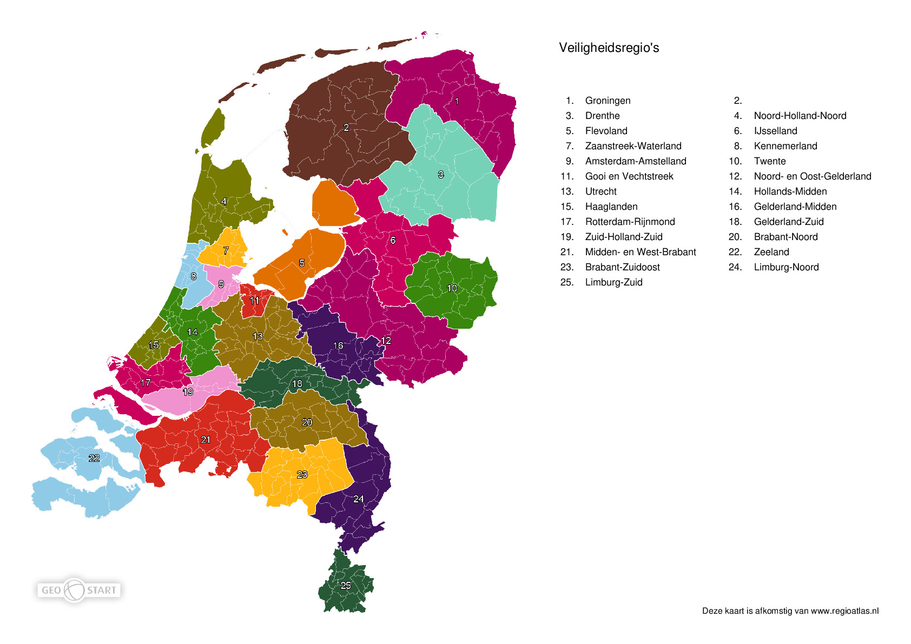

```{r setup, include=FALSE}
knitr::opts_chunk$set(echo = FALSE, dpi = 300, fig.width = 8, fig.heigh = 6, message = FALSE, warning = FALSE)

library(tidyverse)
library(ggfortify)

rna <- read_csv("data/COVID-19_rioolwaterdata.csv")
cases <- read_delim("data/COVID-19_aantallen_gemeente_per_dag.csv", delim = ";")
regions <- read_delim("data/veiligheidsregios.csv", delim = ";")

# Correct spelling
rna$Security_region_name[rna$Security_region_name == "Friesland"] <- "Fryslân"
rna$Security_region_name[rna$Security_region_name == "Ijsselland"] <- "IJsselland"
```

# Introduction
This analysis explores the available data on the presence of SARS-CoV-2 in untreated influent and its relationship with case development in the Netherlands.

## Data Files
The samples are taken from wastewater treatment plants (Rioolwaterzuiveringsinstallatie in Dutch, abbreviated RWZI) around the country. The `COVID-19_rioolwaterdata.csv` file contains `r nrow(rna)` observations of SARS-CoV-2 RNA per ml influent. The data is made available by the RIVM on their [website](https://data.rivm.nl/geonetwork/srv/dut/catalog.search#/metadata/a2960b68-9d3f-4dc3-9485-600570cd52b9). The data contains a date, location information, sample type and the concentration of SARS-CoV-2 RNA per ml untreated influent:

*	`Date_measurement`: Start of sample date (YYYY-MM-DD)
*	`RWZI_AWZI_code`: Location Code (RWZI is sewage treatment plant, AWZI is effluent treatment plant). 
*	`RWZI_AWZI_name`: Location name
*	`X_coordinate`: Projected x-coordinate 
*	`Y_coordinate`: Projected y-coordinate
*	`Postal_code`: Postal code
*	`Security_region_code`: Code of security region (emergency management designation)
*	`Security_region_name`: Name of security region.
*	`Percentage_in_security_region`: Estimated proportion (0-1) of catchment area in security region 
*	`RNA_per_ml`: Average concentration SARS-CoV-2 RNA per ml untreated influent. 
*	`Representative_measurement`: Sample time. True = 24-hr, False = grab sample.

The `COVID-19_aantallen_gemeente_per_dag.csv` file contains the case numbers by municipality and other spatial groupings, including security region. This data is also extracted from the [RIVM website](https://data.rivm.nl/geonetwork/srv/dut/catalog.search#/metadata/5f6bc429-1596-490e-8618-1ed8fd768427).

* `Date_of_report`: Date data was extracted.
* `Date_of_publication`: Date case numbers were reported.
* `Municipality_code`: Code of municipality.
* `Municipality_name`: Name of municipality.
* `Province`: name of province.
* `Security_region_code`: Code of security region (emergency management designation).
* `Security_region_name`: Name of security region.
* `Municipal_health_service`: Health care provider.
* `ROAZ_region`: Healthcare provider region.
* `Total_reported`: Total reported number of cases.
* `Hospital_admission`: Number of hospital admissions.
* `Deceased`: Number of deceased patients.

The Netherlands is divided in 25 security regions. Both the laboratory data and the cases data is provided by security region. Each security region consists of several municipalities. The `veiligheidsregios.csv` file lists the population in each security region. This data is extracted from the [Dutch government atlas](https://www.regioatlas.nl/regiokaart/21):

* `Gemeente`: Municipality.
* `CBS`: Bureau of Statistics reference
* `Veiligheidsregio's`: Name of security region
* `Inwonersaantal van regio`: Number of people in the security region.



The catchment areas of wastewater treatment plants are not limited to municipal boundaries. Where a wastewater treatment plant serves populations in more than one security region, the RNA results are split between the two security regions, as noted in the `Percentage_in_security_region` field.

# Exploratory Analysis
The number of cases in the Netherlands, and the subsequent hospitalisations and deaths shows the development of a second wave. Interestingly, the proportion of serious and terminal cases is much lower during the second wave. This change is largely cuased by the fact that after 1 juni, everybody in the Netherlands could get tested.

```{r}
cases %>% 
  select(Date_of_publication, Total_reported, Hospital_admission, Deceased) %>% 
  group_by(Date_of_publication) %>% 
  summarise(Reported = sum(Total_reported),
            Hospitalised = sum(Hospital_admission),
            Deceased = sum(Deceased)) %>% 
  pivot_longer(-Date_of_publication) %>% 
  ggplot(aes(Date_of_publication, value, col = name)) + 
  geom_line(size = 1) + 
  theme_classic() + 
  labs(title = "CoViD-19 case development in the Netherlands",
       caption = "Source: RIVM",
       x = "Date", y = NULL, guide = NULL)
```

The Netherlands are serviced by a large number of wastewater treatment plants, `r length(unique(rna$RWZI_AWZI_code))` of which have been sampled for the presence of SARS-CoV-2 virus RNA. 

```{r, fig.caption="Number of SARS-Cov-2 samples per wastewater treamnet plant."}
rna %>% 
  group_by(RWZI_AWZI_code, RWZI_AWZI_name, X_coordinate, Y_coordinate, Security_region_name) %>% 
  summarise(Samples = n()) %>% 
  ggplot(aes(X_coordinate, Y_coordinate, size = Samples, col = Security_region_name)) + 
  geom_point(alpha = .5) + 
  scale_size_area(max_size = 10) +
  scale_color_manual(values = rep(c("#a7005f", "#275936", "#ffb612", "#95720b", "#8fcbe7"), 5), 
                     name = "Security Region") + 
  coord_equal() + 
  theme_void() + 
  labs(title = "SARS-CoV-2 effluent samples in the Netherlands",
       caption = "Data source: RIVM",
       x = "Date", y = NULL, guide = NULL)
```

# Normalised data
The data is normalised per 100,000 people and analysed per security region. The graphic shows that case numbers have mostly increased in densely populated areas, such as Amsterdam (Amsterdam-Amstelland) and The Hague (Haaglanden).

```{r}
regions_pop <- regions %>% 
  select(Security_region_name = `Veiligheidsregio's`,
         Population = `Inwoneraantal van regio`) %>% 
  distinct(Security_region_name, .keep_all = TRUE)

regions_pop$Security_region_name[regions_pop$Security_region_name=="Frysl&acirc n"] <- "Fryslân"
  
cases_region <- cases %>% 
  group_by(Date = Date_of_publication, Security_region_name) %>% 
  summarise(Cases = sum(Total_reported)) %>% 
  left_join(regions_pop) %>% 
  mutate(Cases_f = Cases / (Population / 10^5)) %>% 
  filter(!is.na(Security_region_name))

ggplot(cases_region, aes(Date, Cases_f)) + 
  geom_line(col = "blue") + 
  facet_wrap(~Security_region_name) + 
  theme_classic() + 
  labs(title = "CoViD-19 case development in the Netherlands",
       subtitle = "Cases per 100,000 people per Security Region",
       caption = "Data source: RIVM",
       x = "Date", y = NULL, guide = NULL)
```

```{r}
rna_region <- rna %>% 
  group_by(Date = Date_measurement, Security_region_name, Representative_measurement) %>% 
  summarise(RNA_per_ml = mean(RNA_per_ml))

rna_region <- rna_region %>% 
  left_join(regions_pop) %>% 
  mutate(RNA_per_ml_pop = RNA_per_ml / (Population / 10^5))

ggplot(rna_region, aes(Date, RNA_per_ml_pop)) + 
  geom_line(col = "blue") + 
  facet_wrap(~Security_region_name) + 
  theme_classic() + 
  labs(title = "SARS-CoV-2 influent samples in the Netherlands",
       subtitle = "Mean RNA per ml per 100,000 people per Security Region",
       caption = "Data source: RIVM",
       x = "Date", y = NULL, guide = NULL)

```

# Correlations
The graph below shows the correlation between the normalised SARS-CoV-2 results and the number of CoViD-19 cases. The data has not been shifted to allow for a lag between detection and case development.

```{r}
rna_model <- full_join(rna_region, cases_region)

ggplot(rna_model,aes(RNA_per_ml_pop, Cases_f, col = Representative_measurement)) + 
  geom_point() +
  scale_color_manual(name = "Represenative measurment", values = c("red", "blue", "gray")) + 
  scale_x_log10() + 
  scale_y_log10() + 
  theme_classic() + 
  labs(title = "Correlation between SARS-CoV-2 influent samples and case number",
       subtitle = "Zero lag",
       caption = "Source: RIVM",
       x = "RNA per ml per 100,000 people (log-scale)", 
       y = "Cases per 100,000 people (log-scale)", guide = NULL)
```

# Regression
One outlier removed

```{r}
outlier <- which(rna_model$RNA_per_ml_pop == max(rna_model$RNA_per_ml_pop, na.rm = TRUE))

fit <- lm(Cases_f ~ RNA_per_ml_pop, data = rna_model[-outlier,])

autoplot(fit)
```


